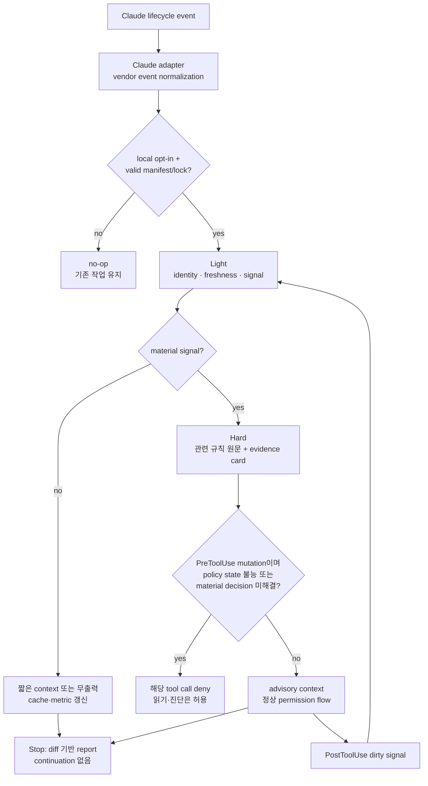

# 능동형 policy loop 실행 계획

상태: 2026-09-21 기준 core/Claude adapter와 약식 target 파일럿까지 실행했다. 공개 release·self manifest/lock upgrade·독립 승격 결정은 아직 하지 않았다.

현재 증거는 unit/contract test 19개, 대상 application baseline 164 tests와 Ruff, 9개 분류 scenario의 지연·context 측정이다. 실제 Claude prompt hook 연결은 확인했지만 실행 환경의 미로그인과 session-directory 제한 때문에 model 과금 및 모든 lifecycle end-to-end는 미검증이다. 상세 수치는 [initial pilot](../../../docs/pilots/active-policy-loop-initial.md)에 있다.

## 한눈에 보는 실행 흐름

사용자가 얻게 되는 기능은 ‘모든 규칙을 항상 암송하는 AI’가 아니라 ‘작업 checkpoint마다 저비용으로 관련성을 판정하고, 중요한 경우에만 규칙 원문과 증거 질문을 현재 작업에 삽입하는 AI’다.

## 구현 단위

| 단위 | 책임 | 하지 않는 일 |
| --- | --- | --- |
| core runner | eligibility, fingerprint, Light/Hard 선택, rule resolution, closed result | vendor event JSON 직접 해석 |
| Claude adapter | Claude event를 공통 event로 변환하고 JSON output/deny를 매핑 | policy 의미 판정 |
| policy reader | manifest·lock과 lock이 가리키는 rule 원문을 read-only로 읽음 | latest 자동 채택, lock 재생성 |
| signal classifier | prompt/tool/diff에서 material signal과 changed surface를 결정적으로 추출 | 제품 의도 추측 |
| evidence card builder | observed/inferred/human-approved/unknown과 pass/warn/fail/human-review를 구성 | 사람 승인 대행 |
| session state | fingerprint, 이미 제공한 카드, dirty/material signal, metric을 비정본 cache에 보존 | project source나 ADR 수정 |
| reporter | terminal/JSON 결과와 pilot metric을 redaction 후 출력 | source 전문·secret·prompt 원문 수집 |

core의 공통 event는 최소한 `session-start`, `prompt-submit`, `pre-tool`, `post-tool`, `turn-stop`을 가진다. adapter별 원문 필드는 별도 namespace에 남기되 core가 vendor 이름으로 분기하지 않게 한다.

## Claude event 적용표

| Claude event | 첫 파일럿 행동 | 차단 여부 | 비용 제어 |
| --- | --- | --- | --- |
| `SessionStart` | opt-in·manifest·lock·policy source 확인, cache 초기화, Light context 주입 | 차단 불가; 실패를 gate로 주장하지 않음 | rule 본문 미로드, 빠른 identity 확인 |
| `UserPromptSubmit` | prompt surface를 Light 분류, material이면 Hard 카드 주입 | prompt 자체는 차단하지 않음 | 정상 no-op 무출력, 중복 fingerprint 생략 |
| `PreToolUse` | tool과 input을 mutation/read-only로 분류, 새 material signal 재평가 | 확정된 policy-state 오류/open material decision 뒤 mutation만 deny | matcher로 mutation 가능 tool 우선, 기존 카드 재사용 |
| `PostToolUse` | 성공한 mutation의 dirty surface와 새 signal만 기록 | 이미 실행됐으므로 차단 안 함 | 전체 검사 대신 cache invalidation |
| `Stop` | dirty diff에 대해 Light, 필요 시 Hard report를 생성하고 사람에게 보임 | continuation·exit 2 미사용 | dirty/material일 때만 실행, 동일 diff dedup |

`PreToolUse` command/http hook timeout은 도구 호출을 막지 않고 정상 permission flow로 진행하며, 실행 파일 누락도 대부분 non-blocking이다. 따라서 첫 구현은 “오류 시 항상 중단”을 보장한다고 쓰지 않는다. 파일럿 이후 fail-close가 필수로 확인되면 Claude command hook이 아니라 Agent SDK callback 또는 외부 wrapper를 별도 architecture decision으로 검토한다.

## Light에서 Hard로 올라가는 신호

아래 중 새 신호가 하나라도 있으면 Hard로 상승한다. 이미 같은 fingerprint로 평가했고 승인·guardrail이 변하지 않았다면 결과를 재사용한다.

- 공개 API, HTTP method/path/status/error, streaming/message/schema 변경
- 인증·인가·secret·민감 데이터·외부 network boundary 변경
- DB/cache/stream/file 저장 구조, migration, data ownership 변경
- dependency/import/runtime/IaC/deployment/environment configuration 변경
- 비용·가용성·복구·observability hard constraint에 영향을 주는 변경
- 활성 change spec/ADR/exception의 material revision 또는 충돌
- manifest/lock/policy digest 불일치, rule source 접근 실패
- 완료 diff가 prompt와 pre-tool 단계에서 보지 못한 surface를 포함

문서 오탈자, 설명만 요청하는 대화, 검증된 read-only 조사, 같은 fingerprint의 반복 event는 기본적으로 Light에서 끝난다. 분류가 불확실하지만 material 영향 가능성이 있으면 저비용을 이유로 Light에 남기지 않고 Hard와 `human-review`로 보낸다.

여기서 불일치는 pinned artifact의 내부 무결성이나 source 접근 불능을 뜻한다. 프로젝트가 유효한 이전 release에 고정되어 있다는 사실, spec-it에 더 최신 candidate가 있다는 사실, 단순 version lag는 Hard deny 신호가 아니다. 최신 정책 비교는 파일럿의 governing lane에서 제외한다.

## 결과와 차단 상태

| runner 상태 | advisory 출력 | mutation PreToolUse | read-only tool |
| --- | --- | --- | --- |
| `pass` / `not-applicable` | 필요한 경우 짧은 근거 | 정상 permission flow | 허용 |
| `warn` / 일반 `fail` | 관련 rule, 근거, 수정 후보를 보고 | 파일럿에서는 자동 deny 안 함 | 허용 |
| `human-review` | 결정 package 또는 missing evidence | material 결정이 실제 open으로 확정된 경우 deny | 조사 허용 |
| `policy-unavailable` | manifest/lock/source 문제와 복구 방법 | deny | 조사 허용 |
| `runner-error` | 오류·event·fail-open 여부 기록 | command hook 한계상 진행될 수 있음 | 진행 가능 |

`runner-error`와 `policy-unavailable`을 섞지 않는다. 전자는 실행 장치가 판단하지 못한 상태이고, 후자는 runner가 정상 실행되어 승인된 policy state를 사용할 수 없다고 판정한 상태다. 이 구분이 “hook이 고장 났는데 안전하게 막혔다”는 잘못된 보고를 방지한다.

## 단계별 작업과 gate

### 0단계 — 변경 격리와 기준선 고정

작업:

- 현재 별도 `0.6.0` candidate diff와 이 변경의 file set을 분리한다.
- `v0.5.0`, self manifest/lock, 현재 candidate commit/dirty 식별자를 기록한다.
- 공개 core에 대상 프로젝트 이름·경로·비공개 prompt를 넣지 않는 fixture 규칙을 고정한다.
- 구현용 branch 또는 worktree를 만들 때 기존 dirty 변경을 포함할지 명시적으로 선택한다.

Gate G0:

- hook 변경의 stage/commit 목록에서 기존 `0.6.0` code-rule candidate가 의도치 않게 섞이지 않는다.
- 대상 프로젝트에는 아직 hook 설정이나 코드 변경이 없다.

### 1단계 — 공통 계약과 red test

작업:

- normalized event, Light/Hard decision, result state, evidence origin, adapter output schema를 먼저 정의한다.
- AC-01~12의 합성 fixture와 expected result를 구현 전에 고정한다.
- mutation/read-only tool taxonomy는 allowlist가 아니라 보수적인 classifier로 설계한다. 모르는 tool은 material mutation 가능성으로 분류하되 advisory pilot의 범위를 유지한다.
- session state 경로, redaction, fingerprint/invalidation 계약을 정의한다.
- runner runtime은 대상 환경의 기존 runtime, 추가 dependency, cold-start, macOS/Linux/Windows fixture 가능성을 비교해 선택한다. 이 기술 선택이 새 사용자 동작이나 외부 서비스 의존성을 만들면 진행 전에 별도 승인을 받는다.

Gate G1:

- core contract는 Claude 필드 이름 없이 표현된다.
- 잘못된 manifest/lock, missing rule, timeout, duplicate event, Stop 재진입 반례가 fixture에 있다.
- 최소 한 개 red 결과가 ‘구현 부재’ 때문에 실패하고, 기대값을 구현에 맞춰 바꾸지 않는다.

### 2단계 — Light runner

작업:

- opt-in, manifest/lock identity, policy source reachability, event/fingerprint, signal classification을 read-only로 구현한다.
- no-op은 stdout context를 만들지 않고 metric만 비정본 state에 남긴다.
- rule ID와 source path index를 cache하되 rule 본문은 읽지 않는다.
- Light 출력 4,000자, hook 별도 model call 0회, 동일 fingerprint 중복 0회를 초기 budget으로 둔다.

Gate G2:

- AC-01~04와 AC-11의 Light 부분이 통과한다.
- project source와 git index가 바뀌지 않는다.
- cold/warm latency를 기록하고 숫자를 충족하지 못해도 숨기지 않는다. 파일럿 전에 p95 budget을 측정 baseline으로 확정한다.

### 3단계 — Hard evaluator와 평가 카드

작업:

- material signal을 lock의 관련 rule ID로 연결하고 최대 8개 원문만 읽는다.
- 카드마다 적용 여부, statement/forbidden, observed, inferred, human-approved, unknown, evidence, result, next action을 반환한다.
- 현재 Claude turn에 카드가 들어가도록 adapter-neutral context를 만든다. 별도 Claude/API/model 호출은 하지 않는다.
- 8개 또는 8,000자를 넘으면 임의 pass 대신 범위 초과와 `human-review`를 반환한다.

Gate G3:

- AC-05~08과 관련성 반례가 통과한다.
- 모든 규칙/스킬을 읽지 않았음을 I/O trace로 증명한다.
- 같은 구현을 평가한 AI의 주장만으로 `pass`가 된 항목은 human-review로 남는다.

### 4단계 — Claude adapter

작업:

- `SessionStart`, `UserPromptSubmit`, `PreToolUse`, `PostToolUse`, `Stop` input을 normalized event로 변환한다.
- command hook은 shell interpolation을 피하는 exec form과 명시적 args를 우선한다.
- `.claude/settings.local.json` 예시는 local opt-in으로만 제공하고 shared settings에 자동 복사하지 않는다.
- `PreToolUse` deny는 Claude의 구조화 JSON decision을 사용한다. 다른 결과는 정상 permission flow를 대체 승인하지 않는다.
- Stop은 report를 표시하되 `decision: block`, exit 2, `additionalContext` continuation을 사용하지 않는다.

Gate G4:

- Claude 공식 input fixture에 대한 adapter contract test가 통과한다.
- malformed JSON, missing executable, non-executable file, timeout을 실제 Claude debug log에서 구분한다.
- SessionStart·Stop이 hard gate라고 보고되지 않는다.

### 5단계 — spec-it 저장소 검증

작업:

- unit/contract/integration fixture를 실행하고 terminal·JSON report를 비교한다.
- Linux/macOS path와 가능한 범위의 Windows separator fixture를 검증한다.
- secret-like input, 긴 prompt, binary/large diff, symlink와 repo 밖 path를 redaction·boundary 사례로 다룬다.
- 기존 Phase 0 문서와 roadmap을 실제 구현 상태에 맞게 갱신한다. 구현 뒤에만 Phase 1이라고 선언한다.

Gate G5:

- AC-01~12 중 저장소 내 합성 검증이 전부 판정된다.
- `not-run`, `human-review`, vendor limitation을 pass로 합산하지 않는다.
- 기존 0.6 candidate와 hook candidate의 selective diff가 분리된다.

### 6단계 — 지정 Python HTTP API에서 Claude 파일럿

작업:

- 대상 저장소의 승인된 manifest·lock·현재 dirty state와 기존 `.claude` 설정을 먼저 읽는다.
- 별도 worktree 또는 사용자가 승인한 checkout에서 `.claude/settings.local.json`으로만 opt-in한다.
- 설명/읽기, 작은 code edit, API 계약, DB migration, dependency, secret/config, invalid lock, open decision, hook timeout, completion diff의 최소 10개 시나리오를 수행한다.
- 실제 제품 코드 mutation이 필요한 사례는 fixture 또는 disposable branch를 우선하며 운영 DB·배포를 건드리지 않는다.
- 사람이 ‘필요했던 경고/불필요한 경고/놓친 경고/중복 질문’을 판정한다.

Gate G6:

- Light no-op 비율, Hard 상승 이유, event별 p50/p95, context 문자 수, 오류/timeout, 오탐/누락, 사람 중단 횟수가 기록된다.
- 일반 finding이 advisory로 남았고 policy-unavailable/open-decision mutation만 의도대로 deny됐는지 확인한다.
- hook 비활성화 후 대상 저장소의 기존 Claude 동작으로 복구된다.

### 7단계 — 독립 검토와 승격 결정

작업:

- 구현자가 아닌 검토자가 명세, 공식 Claude 계약, fixture, target pilot evidence를 대조한다.
- 비용 대비 발견 가치와 놓친 사례를 기준으로 유지/수정/폐기 중 하나를 결정한다.
- 다음 후보를 각각 독립적으로 판정한다: shared project setting, command-hook block 확대, Agent SDK fail-close wrapper, Codex adapter, Medium/Deep, CI 연계.
- 승인된 경우 migration, release checklist, self manifest/lock 재수렴과 tag/publication을 별도 실행한다.

Gate G7:

- 사용자 승인이 있는 disposition과 알려진 limitation이 있다.
- `0.7.0` release는 실제 source·test·migration·checklist·tag가 갖춰진 뒤에만 완료로 기록한다.
- pilot 성공을 모든 AI 도구와 모든 저장소의 enforcement 성공으로 일반화하지 않는다.

## 파일럿 시나리오 묶음

| Scenario | 기대 mode | 핵심 관찰 |
| --- | --- | --- |
| P-01 설명만 요청 | Light | no-op, 추가 model call 없음 |
| P-02 read-only repository 조사 | Light | source mutation 없음 |
| P-03 작은 내부 refactor | Light → 필요 시 Hard | 공개 계약 신호가 없으면 제한된 카드 |
| P-04 endpoint/status/field 변경 | Hard | API 관련 rule만 선택 |
| P-05 DB column/migration 변경 | Hard | 소유권·release unit·복구 evidence |
| P-06 dependency 또는 external client 추가 | Hard | security/cost/infrastructure 재판정 |
| P-07 secret/environment 변경 | Hard | 값 비노출, configuration contract |
| P-08 manifest/lock 무결성 실패·source 접근 불능 뒤 Write | Hard | Write deny, Read 허용 |
| P-09 material open decision 뒤 Bash mutation | Hard | mutation deny와 decision package |
| P-10 hook executable 누락/timeout | 오류 | fail-open limitation과 debug evidence |
| P-11 같은 prompt/tool 재시도 | cache | 같은 카드·질문 중복 없음 |
| P-12 예상 밖 completion diff | Hard at Stop | 사람에게 report, 자동 continuation 없음 |

## 측정과 중단 기준

다음 중 하나면 파일럿 확장을 중단하고 설계를 수정한다.

- Light가 정상 대화의 체감 지연을 반복적으로 만든다.
- Hard가 관련 없는 규칙을 반복 선택하거나 중요한 rule을 놓친다.
- local opt-in 없이 실행되거나 project source를 수정한다.
- hook 오류를 policy deny로 잘못 보고하거나, deny 때문에 원인 조사도 불가능해진다.
- 같은 결정이 있는데 사람에게 반복 질문한다.
- secret, prompt 원문, source 전문이 metric/report에 남는다.
- Stop이 반복 continuation 또는 종료 불능을 만든다.

성공하더라도 곧바로 block 범위를 넓히지 않는다. 최소 한 차례의 human disposition에서 advisory의 발견 가치, false positive, missed rule, 비용을 함께 본 뒤 다음 enforcement를 결정한다.

## 구현 시작 시 첫 작업 묶음

1. 기존 `0.6.0` dirty candidate의 소유 범위와 base commit을 다시 확인한다.
2. 이 change package의 AC-01~12를 fixture manifest로 옮기고 red baseline을 만든다.
3. normalized event/result schema와 Light budget만 구현한다.
4. G0~G2를 통과한 뒤 Hard와 Claude adapter 작업을 시작한다.

이 순서는 처음부터 모든 hook·skill·mode를 만드는 범위 팽창을 막는다. 구현 승인 다음의 첫 milestone은 “Claude에서 Light가 안전하게 no-op할 수 있음”이며, 그 뒤에만 Hard와 mutation deny를 추가한다.
