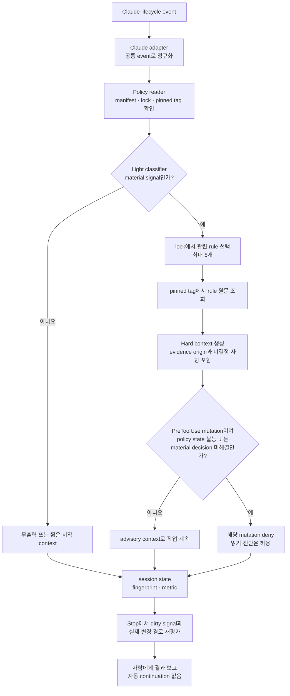

# Active policy loop

전체 흐름은 [능동형 정책 루프 다이어그램](diagrams/active-policy-loop.html)에서 한 화면으로 확인할 수 있다.

active policy loop는 모든 규칙과 스킬을 매번 읽는 장치가 아니다. 명시적으로 활성화된 프로젝트에서 lifecycle event를 저비용으로 분류하고, material signal이 있을 때만 pinned lock이 가리키는 관련 규칙을 현재 AI turn에 제공하는 실험적 실행 장치다.

공개 `0.5.0`의 규범 정본은 계속 `rules/`, `profiles/`, project manifest와 lock이다. runner는 새 정책을 만들거나 최신 버전으로 자동 업그레이드하지 않는다.

## 동작 메커니즘



### 1. Hook은 checkpoint를 호출한다

Claude Code는 `SessionStart`, `UserPromptSubmit`, `PreToolUse`, `PostToolUse`, `Stop`에서 command hook을 실행한다. Hook 자체는 정책을 판정하지 않고, 현재 event를 runner에 전달하는 시작점이다.

| Event | runner가 확인하는 내용 |
| --- | --- |
| `SessionStart` | local opt-in, manifest·lock identity, pinned policy 접근 가능 여부 |
| `UserPromptSubmit` | 요청에 material 변경 의도가 있는지 |
| `PreToolUse` | 도구가 mutation인지, 새 material signal이 있는지, 좁은 deny 조건인지 |
| `PostToolUse` | 작업 중 새로 드러난 dirty signal |
| `Stop` | 실제 변경 경로와 작업 중 누적된 signal |

### 2. Claude adapter는 vendor 형식을 공통 event로 바꾼다

Claude adapter는 Claude 전용 event 이름과 JSON을 `session-start`, `prompt-submit`, `pre-tool`, `post-tool`, `turn-stop`으로 정규화한다. Core runner는 Claude 출력 형식을 알지 않으며, adapter가 core 결과를 Claude의 `additionalContext`, `permissionDecision`, `systemMessage`로 다시 변환한다. 이 경계는 이후 다른 AI adapter가 같은 core를 재사용할 수 있게 한다.

### 3. Policy reader는 프로젝트가 고정한 규칙책을 확인한다

Runner는 프로젝트의 `.architecture/manifest.yaml`과 `.architecture/lock.yaml`에서 policy source와 version이 같은지 확인한다. Lock이 `generated: true`인지, 해당 `v{version}` tag가 local policy checkout에 존재하는지도 확인한다. 유효한 이전 release에 고정된 사실은 오류가 아니며 최신 candidate를 자동 채택하지 않는다.

### 4. Light는 별도 AI 호출 없이 signal만 분류한다

Light는 Python의 결정적 classifier다. 별도 model이나 agent를 호출하지 않고 prompt, tool input, 변경 경로에서 API·data·security·dependency·infrastructure·configuration·material intent signal을 찾는다.

- 설명, read-only 조사, 명시적인 no-change 요청: 정상적으로 무출력
- material signal이 있는 변경 요청 또는 mutation tool: Hard로 상승
- `SessionStart`: 고정 policy identity와 재평가 조건만 짧게 전달

### 5. Hard는 관련 규칙만 현재 turn에 투영한다

Hard는 별도 AI가 아니라 관련 규칙을 읽어 현재 Claude turn에 제한된 context를 제공하는 단계다. Signal을 rule ID prefix에 연결하고 lock에 포함된 후보 중 최대 8개를 선택한다. 각 rule 원문은 현재 worktree가 아니라 프로젝트가 고정한 tag에서 `git show <tag>:<rule-path>`로 읽는다.

Hard context에는 rule ID, condition, obligation, evidence와 다음 evidence origin 구분을 넣는다.

- `observed`: 저장소·설정·실행 결과에서 확인
- `inferred`: 관측 사실에서 추론
- `human-approved`: 사람이 결정
- `unknown`: 아직 확인되지 않음

선택 규칙이 8개를 넘으면 보이는 일부만으로 pass를 추론하지 않고 `human-review`로 남긴다. Context는 최대 8,000자로 제한한다.

### 6. 차단은 mutation 직전의 좁은 조건에서만 수행한다

일반 rule finding은 advisory다. `PreToolUse`가 mutation이고 다음 상태 중 하나가 확정된 경우에만 해당 호출을 구조화된 `deny`로 반환한다.

- manifest·lock identity 불일치, pinned tag 또는 selected rule source 접근 불능
- 활성 change spec에 material human decision이 열려 있음

Read·Grep·Glob과 판정된 read-only shell은 원인 조사와 복구를 위해 계속 허용한다. Runner crash, 실행 파일 누락, timeout은 `policy-unavailable`과 구분하며 command hook 특성상 fail-open일 수 있다.

### 7. Session state는 중복과 비용만 추적한다

Runner는 policy version, event, signal, prompt·tool input의 hash, 변경 경로로 fingerprint를 만든다. 같은 fingerprint를 이미 평가했다면 동일한 Hard context를 반복 주입하지 않는다. State에는 event 수, Light·Hard 횟수, no-op, deny, 출력 문자 수, 실행 시간과 fingerprint만 저장하며 prompt 원문이나 source 전문을 저장하지 않는다.

### 8. Stop은 실제 변경 표면을 다시 판정한다

`PostToolUse`에서 누적한 dirty signal과 `git status --porcelain`의 변경 경로를 `Stop`에서 다시 분류한다. Material 변경이면 관련 규칙 context를 `systemMessage`로 보여 주지만, 첫 파일럿은 자동 continuation이나 self-repair loop를 시작하지 않는다. 최종 승인과 예외 결정은 사람이 소유한다.

### 지속적 방향성 유지 방식

이 장치는 모델 내부에 정책을 영구 학습시키지 않는다. 대신 세션 시작, 요청 수신, mutation 직전·직후, 완료 시점의 bounded checkpoint에서 같은 메타 규칙을 반복 적용한다.

> 현재 행동에 적용되는 규칙을 찾고, 관측·추론·사람 승인·미결정을 구분하며, 완료 전에 실제 변경으로 다시 검증한다.

따라서 active policy loop는 모든 규칙을 상시 주입하는 장치가 아니라, 필요한 시점에 고정된 규칙을 다시 투영하는 just-in-time guidance다.

Light와 Hard는 스킬 종류가 아니라 평가 깊이와 비용 budget이다.

| 항목 | Light | Hard |
| --- | --- | --- |
| 기본 사용 | 모든 활성 checkpoint | material signal이 있을 때만 |
| rule 본문 | 읽지 않음 | lock에서 선택된 rule만 읽음 |
| 별도 model 호출 | 없음 | 없음 |
| 출력 | 정상 no-op은 0자, 시작 context 최대 4,000자 | 최대 8 rules / 8,000자 |
| 상태 | ephemeral metric과 fingerprint | 같은 fingerprint의 context 중복 억제 |

API·message·DB·security·dependency·infrastructure·configuration·material intent가 추가·변경되는 요청이나 tool input은 Hard 후보다. 설명, read-only 조사, 명시적인 no-change 요청은 Light에서 끝난다.

## 활성화

manifest와 lock은 프로젝트가 spec-it 정책을 채택할 자격을 뜻한다. 실행 활성화는 별개이며 Claude Code의 project-local `.claude/settings.local.json`에 hook을 넣어 명시한다. manifest schema에 vendor별 opt-in을 추가하지 않는다.

1. [example settings](../examples/claude-hook-pilot/settings.local.json)을 프로젝트의 `.claude/settings.local.json`에 맞게 복사한다.
2. `/absolute/path/to/spec-it`을 실제 checkout으로 바꾸거나 `SPEC_IT_ROOT`를 절대 경로로 설정한다.
3. `.claude/settings.local.json`이 source control에 들어가지 않도록 확인한다.
4. 프로젝트 manifest/lock이 고정한 tag가 policy checkout에 존재하는지 확인한다.

CLI는 Claude hook JSON을 stdin으로 받고 구조화 JSON만 stdout에 반환한다.

```bash
python3 /absolute/path/to/spec-it/tools/spec_it_hook.py \
  --enabled \
  --project-root /absolute/path/to/project \
  --policy-root /absolute/path/to/spec-it
```

`--enabled`가 없으면 runner는 상태 파일도 만들지 않는 true no-op이다. session state는 기본적으로 시스템 임시 디렉터리에 저장되고 prompt나 source 전문은 기록하지 않는다.

## 집행과 실패

일반 rule finding은 advisory다. 다음 두 상황에서만 `PreToolUse` mutation을 구조화된 `deny`로 반환한다.

- manifest와 lock의 policy identity가 다르거나 pinned tag/rule source를 읽을 수 없는 `policy-unavailable`
- 활성 change spec에 material decision이 열린 상태

Read·Grep·Glob과 판정된 read-only shell은 원인 조사와 복구를 위해 허용한다. 유효한 이전 policy version에 고정된 사실 자체는 오류나 차단 사유가 아니다.

runner crash, 실행 파일 누락, command hook timeout은 Claude Code command hook의 non-blocking 동작에 따라 fail-open일 수 있다. 이를 policy deny 성공으로 보고하지 않는다. 강한 fail-close가 필요하면 command hook이 아니라 별도 wrapper/SDK 결정을 해야 한다.

Stop은 `systemMessage`만 반환한다. 첫 파일럿에서는 continuation이나 self-repair loop를 만들지 않으며 최종 승인과 예외는 사람이 소유한다.

## 범위

현재 후보는 Python 표준 라이브러리만 사용한 Claude-first adapter다. Codex adapter, Medium/Deep mode, shared team settings, CI/release gate, 정책 자동 수정, lock 재생성은 포함하지 않는다.
