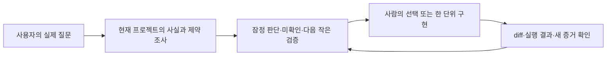

# 함께 판단하고 구현하기

기본 진입점은 프로젝트의 `AGENTS.md`와 고정된 manifest·lock이다. “우리 서비스에 RDS가 필요할까?”, “이 설정을 같이 구현하자”처럼 프로젝트를 가리키는 질문에서는 기존 안내와 필요한 specify·clarify·impact·check 절차로 조사와 판단을 시작한다. 일반 개념 질문에는 바로 답한다.

`spec-it:pair`는 같은 문제를 짧은 단위로 풀어 가는 선택적·미발행 지침 후보다. 별도 스킬 설치는 이 작업 방식의 필수 조건이 아니다. 후보 파일이 source에 있다는 사실은 호스트에 설치·노출·자동 선택됐다는 증거가 아니며, 추가 스킬의 필요성과 실사용 효과는 아직 확인되지 않았다.

사람은 목적·수용 결과·중요한 위험 선택을 소유한다. AI는 저장소와 접근 가능한 운영 증거를 조사하고 선택지·검증 방법을 제안한다. 누가 코드를 쓰는지는 작업에 따라 바뀔 수 있다. 역할을 바꾸는 것이 파일 수정이나 배포의 새 권한을 뜻하지 않는다.

## 가상 예시: 인프라 질문

> **사용자:** “트래픽이 늘 것 같은데 우리 서비스도 EKS로 옮겨야 할까?”
>
> **AI:** “현재 배포 정의와 실제 부하·복구 근거를 확인해 보겠습니다. 확인된 구성으로 요구를 충족하는지 먼저 판단하고, 아직 측정하지 않은 부분은 미확인으로 남기겠습니다. 그 결과에 따라 현 구성 유지, 작은 확장, 이전 실험을 총비용과 운영 부담까지 비교하겠습니다. 목표 장애 시간은 기존 승인 기록에 없을 때만 여쭙겠습니다.”

위 응답은 형식 예시이며 특정 프로젝트의 실제 구성이 확인됐다는 뜻이 아니다. 조사 뒤에는 한 번에 모든 인프라를 설계하기보다 지금의 판단을 바꿀 수 있는 검증 하나를 고른다. 이미 승인된 목표와 guardrail 안이면 다시 허가받지 않고 진행한다. 미결정이 구현 결과에 영향을 주면 선택지·추천·영향·위험·예상 변경·복구·증거를 묶어 사람에게 제시한다.

| 작업 중 놓치지 않을 철학 | 적용 정본·경계 | 페어 대화에서의 적용 |
| --- | --- | --- |
| 사람의 의도와 중요 위험은 사람이 결정 | [GOV-002](../rules/governance/GOV-002.md), [HITL-001](../rules/hitl/HITL-001.md), [HITL-002](../rules/hitl/HITL-002.md) | AI는 조사와 추천을 맡고 새 material 결정의 승인 상태를 분리한다. |
| 안전·법·무결성과 합의된 신뢰성 우선 | [COST-001](../rules/cost/COST-001.md) | 절대 제약을 위반하는 선택지를 먼저 제외한다. |
| 돈과 사람·AI 시간, 운영·실패 비용까지 비교 | [COST-002](../rules/cost/COST-002.md) | 수용 가능한 대안의 총비용과 가정을 함께 제시한다. |
| 현재 제품의 안정성 유지 | [COMP-001](../rules/compatibility/COMP-001.md), [REL-001](../rules/reliability/REL-001.md), [TST-002](../rules/testing/TST-002.md) | 관련 계약·복구·수용 결과에 미치는 영향을 확인하고 독립된 관찰로 검증한다. |
| AI 간 구현 일관성 | [RULE-001](../rules/rule-system/RULE-001.md), [TOOL-002](../rules/tooling/TOOL-002.md) | 규칙 사본이나 기억 대신 고정된 정책 정본과 lock을 읽는다. |
| 개인 철학의 축적과 재사용 | [RULE-001](../rules/rule-system/RULE-001.md), [공개 경계](../NO_PRIVATE_DATA.md) | 공개 가능한 공통 의무만 정본 규칙으로 유지하고 개인 판단 기록은 별도로 둔다. |
| 인프라는 제품 이름보다 조건과 증거로 판단 | [INFRA-001](../rules/infrastructure/INFRA-001.md), [INFRA-002](../rules/infrastructure/INFRA-002.md) | 선택된 프로필의 활성 신호·측정·guardrail을 확인하고, 이미 승인된 범위에서는 중단하지 않는다. |
| 미구현 검사와 빠진 증거를 통과로 표시하지 않음 | [RULE-002](../rules/rule-system/RULE-002.md), [TOOL-001](../rules/tooling/TOOL-001.md) | 관측·추론·미확인과 실제 검사 결과를 구분한다. |

이 표가 모든 프로젝트에 모든 규칙을 추가하지는 않는다. 적용 여부는 각 프로젝트가 고정한 manifest와 lock에서 확인한다. 대화 절차는 기존 `spec-it:specify`·`clarify`·`impact`·`check`를 필요한 순간에 연결하며, `rules/` 밖에 새 의무를 만들지 않는다. 파일 저장 hook이나 상시 감시는 필요하지 않다.

[후보 수용 사례](pilots/pair-workflow-acceptance.md)는 작성 전에 고정했지만, 현재는 정적 절차 후보일 뿐이다. 실제 모델이 평소 질문에서 이를 선택하는지, 끼어듦 없이 근거를 찾는지, 사람의 결정을 보존하는지는 프로젝트 작업으로 별도 검증해야 한다.

[S3 기능 추가를 함께 판단하는 흐름](s3-shared-library-pairing.md)은 공통화 판단의 여섯 단계, 현재 pair의 구현 범위, AGENTS 안내로 시작하는 방법과 미실행 검증 사례를 설명한다.
