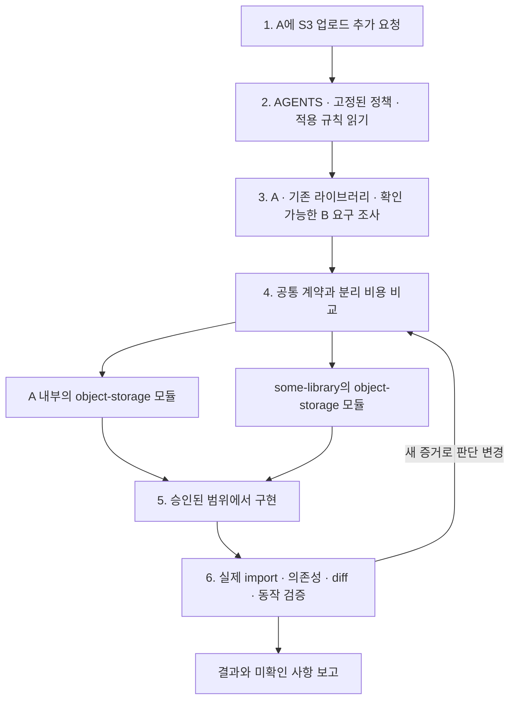
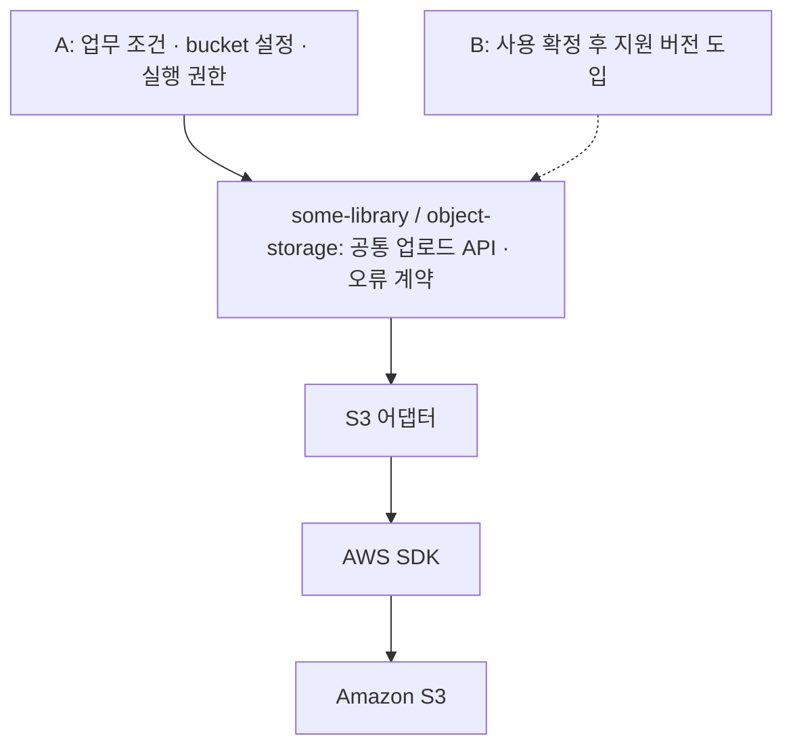
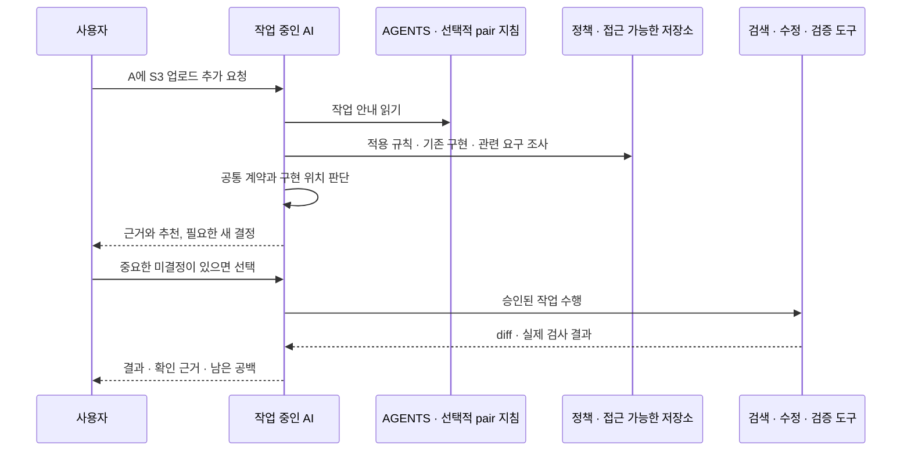

# S3 기능 추가를 함께 판단하는 흐름

AI가 S3 기능을 추가하면서 공통화 여부를 알아차리고, 사용자와 구현 위치를 판단하는 것은 가능한 작업 방식이다. 다만 현재 `spec-it:pair`에 작성된 것은 일반적인 대화 절차다. 아래 S3 사례를 자동으로 수행하고 검증하는 기능까지 구현됐다는 뜻은 아니다.

이 문서는 대화의 visualize 「S3 기능 추가를 함께 판단하는 흐름」을 저장소에서 읽을 수 있도록 옮긴 설명 문서다. 설명 기준일은 2026-10-03이다. `some-lambda-project-a`, `some-lambda-project-b`, `some-library`는 가상 프로젝트이며, 아래 구현 결과도 가정이다. 새 의무는 [규칙 정본](../rules/README.md)에서만 정의한다.

## 사용자가 원하는 동작

> “some-lambda-project-a에 S3 업로드 기능을 추가해줘.”

사용자가 매번 “공통 라이브러리로 만들어야 하는지 확인해줘”라고 덧붙이지 않아도, AI가 관련 규칙과 접근 가능한 코드를 읽고 다음을 판단하는 것이 목표다.

- 이미 재사용할 수 있는 구현이 있는가?
- 다른 프로젝트에서도 같아야 하는 동작이 실제로 확인되는가?
- A 안의 모듈로 충분한가, `some-library`의 모듈로 분리하는 편이 나은가?
- A의 업무 조건과 공통 저장소 동작이 섞이지 않았는가?
- 구현 후 A가 공통 모듈을 실제로 가져다 쓰는가?

“공통화했다”는 설명만으로 완료하지 않고 코드·의존성·검증 결과로 확인한다. B의 사용이 미래 계획뿐이면 B의 재사용을 완료한 것으로 보고하지 않는다.

## 여섯 단계



### 1. 요청에서 신호 발견

AI는 요청과 실제 변경에서 S3 SDK 사용이나 외부 저장소 경계의 변경을 발견한다. 그때 기존 구현과 재사용 가능성을 조사한다. 이 인식은 모델의 추론이며, 현재 pair에는 S3를 감지하는 별도 분류기나 실행 코드가 없다.

사용자에게는 “기존 저장소 모듈과 다른 소비자의 요구를 확인해서 구현 위치를 정하겠습니다” 정도로 조사 방향을 알려준다. 발견할 수 있는 파일 위치나 의존성을 먼저 사용자에게 물어볼 필요는 없다.

### 2. 정본 규칙을 읽기

A의 `AGENTS.md`에서 정책과 프로젝트 안내를 찾고, manifest·lock에서 승인된 정책 버전과 적용 규칙을 확인한다. 경로만 존재한다고 프로젝트가 모든 spec-it 규칙을 채택한 것은 아니다.

| 현재 규칙 | 이 사례에서 확인할 내용 | 규칙이 정하지 않는 내용 |
| --- | --- | --- |
| [ARCH-001](../rules/architecture/ARCH-001.md) | 적용 조건에 해당하면 업무 정책이 AWS SDK에 의존하지 않도록 경계 확인 | S3 코드를 별도 저장소로 옮길지 |
| [ARCH-002](../rules/architecture/ARCH-002.md) | 적용 조건에 해당하면 책임이 명확한 모듈 구성 검토 | 모든 공통 기능의 라이브러리화 |
| [ARCH-003](../rules/architecture/ARCH-003.md) | 추상화에 실제 변동성·외부 경계 격리·승인된 교체 계획의 근거가 있는지 | 두 소비자가 있으면 반드시 별도 저장소로 분리하라는 판단 |
| [COST-002](../rules/cost/COST-002.md) | 적용되는 경우 구현·배포·유지보수·릴리스 조율 비용 비교 | 공통화의 일률적 우선순위 |

현재 규칙에는 “재사용 가능한 S3 코드는 반드시 `some-library`에 구현한다”는 의무가 없다. 이를 사용자의 확정된 정책으로 만들려면 분리 조건과 예외를 먼저 정의해야 한다. 이 문서는 그 규칙을 신설하지 않는다.

### 3. 관련 프로젝트와 요구 조사

| 조사 대상 | 찾을 증거 |
| --- | --- |
| A | 업로드 사용 경로, 입력과 출력, 실패 처리, 설정, 기존 SDK 사용 |
| some-library | 기존 object-storage 모듈, 공개 API, 테스트, 배포 방식, 소유자 |
| B | 동일한 요구가 나타나는 코드 또는 승인된 요구 기록, 공통 계약과 차이 |
| 기존 결정 | 이미 승인된 구현 위치, 지원 언어, 버전 도입 방식, 변경 권한 |

AI에게 관련 저장소의 위치와 읽기 접근이 있어야 한다. A만 보이는 상태에서는 B나 라이브러리의 실제 구조를 확인했다고 말할 수 없다. AI가 어디서 찾아야 할지 모르는 경우, 저장소 위치에 대한 한 번의 확인이 필요할 수 있다.

### 4. 구현 위치를 함께 판단

| 확인된 상황 | 판단 후보 |
| --- | --- |
| 기존 공통 모듈이 요구를 충족함 | 기존 API 재사용. 같은 기능을 A에 다시 만들 필요가 있는지 확인 |
| B의 사용은 막연한 미래 가능성뿐임 | A 안에서 외부 경계를 격리하는 모듈을 우선 검토 |
| A와 B의 공통 동작·계약이 확인됨 | 공유 모듈 후보. 별도 릴리스와 소비자 버전 관리 비용까지 비교 |
| SDK 호출만 같고 업무 조건·오류 의미가 다름 | 공통으로 유지할 계약을 좁히거나 각 프로젝트에 구현 |
| 관련 저장소나 요구를 확인할 수 없음 | 확인된 범위의 잠정 판단. 누락된 근거를 명시 |

실제 두 소비자가 있다는 사실도 별도 저장소 분리의 충분조건은 아니다. 재사용 이익, 변경 책임, 패키지 배포, 호환성 유지 비용을 함께 본다. AWS SDK 호출을 그대로 감싸는 것만으로 새 라이브러리의 가치가 생기지는 않는다.

AI는 근거를 포함한 추천을 제시한다. 승인된 결정이 다음 작업을 이미 포함하면 계속 진행한다. 여러 저장소의 변경이나 새 릴리스 책임처럼 중요한 미결정이 있으면 [HITL-002](../rules/hitl/HITL-002.md)의 결정 절차를 적용한다.

### 5. 승인된 경계에 구현

아래는 공통 모듈을 `some-library`에 두기로 결정한 가상 결과다.



A는 언제 무엇을 업로드할지 결정하고 설정을 전달한다. 공통 모듈은 합의한 업로드 동작과 오류 계약을 제공한다. 실제 IAM 권한은 각 소비자의 실행 환경에서 관리한다. B의 점선은 도입 예정 관계이며, 사용이나 검증 완료의 증거가 아니다.

이 S3 모듈은 저장소 어댑터 라이브러리다. [공유 도메인 코어 라이브러리](domain-core-libraries.md)는 cloud client를 기본 공유 대상에서 제외하므로 S3 모듈을 도메인 코어로 간주하거나, 도메인 라이브러리 전용 [COMP-002](../rules/compatibility/COMP-002.md)를 이름만 보고 적용하면 안 된다.

관련 저장소의 안내는 읽기 위치를 알려준다. 다른 저장소를 수정할 권한까지 부여하지는 않는다. 실제 구현 범위는 사용자의 요청과 기존 승인에서 확인한다.

### 6. 실제 구조와 결과 재확인

- A가 공통 API를 호출하는지, 별도의 중복 구현이 남았는지 확인한다.
- 업무 정책에 SDK 의존성이 들어왔는지 실제 import와 호출 경로를 확인한다.
- 소비자의 의존성 선언과 잠긴 버전, 지원되는 계약을 확인한다.
- 변경된 계약의 성공·실패 동작과 A에서의 사용을 검증한다. 실행한 테스트와 결과를 밝힌다.
- B는 접근·도입·검증한 범위만 보고한다. 저장소의 버전 변경과 실제 배포를 구분한다.

정적 import 검색은 출발점이다. 전이 의존성이나 설정으로 활성화되는 사용은 추가 근거가 필요할 수 있다. 테스트를 실행하지 않았거나 운영 상태에 접근하지 못했다면 그 항목은 미확인이다.

## 현재 pair에 구현된 범위

| 항목 | 현재 소스에서 확인한 상태 |
| --- | --- |
| 질문에서 조사·판단·작은 구현·결과 확인으로 이어지는 절차 | [pair SKILL.md](../skills/spec-it-pair/SKILL.md)에 작성됨 |
| 적용 규칙과 승인 기록을 읽고 사실·추론·미확인을 구분하는 안내 | pair에 작성됨 |
| 새 중요한 결정만 질문하고 승인된 범위는 계속 진행하는 안내 | pair에 작성됨 |
| S3 요청마다 공통화 검토를 수행하는 명시적 조건 | 전용 조건 없음. 일반 지침에 따른 모델 추론에 의존 |
| 관련 저장소 위치·소유자·공통 요구를 찾는 입력 계약 | pair에 정의되지 않음 |
| 로컬 모듈과 별도 라이브러리를 선택하는 S3 절차 | 이 문서의 설계 예시. pair의 전용 기능으로 구현되지 않음 |
| 여러 저장소의 import·버전·동작을 함께 확인하는 전용 검사 | pair 전용 실행 코드 없음 |
| S3 사례에 대한 실제 모델 행동 검증 | 수행 근거 없음. [후보 수용 사례](pilots/pair-workflow-acceptance.md)도 실사용 미검증 상태이며 S3 사례는 포함하지 않음 |
| 별도의 읽기 전용 검증 도구 | 이 변경의 기준선 0.7.0에는 해당 runner 문서·코드가 없음. 다른 검증 작업을 현재 pair 기능으로 간주하지 않음 |

따라서 “일반 pair 절차를 따르는 AI가 이 사례를 조사할 수 있다”와 “S3 공통화 기능이 구현되고 검증됐다”는 구분해야 한다. 현재 확인된 것은 전자에 필요한 일반 지침이다.

## pair가 작동하는 메커니즘

`SKILL.md`는 실행 프로그램이 아니라 AI가 읽는 작업 지침이다. pair의 본문에는 저장소 탐색기를 호출하거나 이벤트를 받아 처리하는 실행 코드가 없다. 실제 파일 검색·읽기·수정·테스트는 호스트 AI가 가진 도구로 수행한다.



이 흐름은 대화 중 현재 요청을 처리할 때 수행된다. pair 파일 자체가 독립적으로 깨어나거나 사용자의 편집을 관찰하지 않는다. 사용자가 직접 작업한 내용은 AI가 읽은 현재 파일·diff·제공된 실행 결과를 통해 판단한다. 접근할 수 없는 편집기 상태나 외부 저장소의 변경을 알아차린다고 보장할 수 없다.

지침을 읽고도 모델이 관련 신호를 놓칠 수 있다. 또한 source에 pair 파일을 작성한 것만으로 호스트가 이를 설치·노출·선택했다고 입증되지는 않는다. 실제 사용 환경에서 지침이 전달되는지와 그 지침을 따르는지 모두 확인해야 한다.

## AGENTS.md로 시작하는 최소 구성

기본 진입점은 프로젝트의 `AGENTS.md`와 고정된 manifest·lock이다. pair는 미발행 후보이며 별도 pair 스킬은 필수 조건이 아니다. A의 `AGENTS.md`에 짧은 설명과 정책·관련 프로젝트의 위치를 두고, 필요한 작업 안내를 읽게 하는 방식으로 시작할 수 있다. 다음은 설치된 설정이 아닌 안내 예시다.

```markdown
## 프로젝트 판단 안내

- 이 프로젝트의 승인된 정책과 적용 규칙은 `.architecture/manifest.yaml`과
  `.architecture/lock.yaml`에서 확인한다. 규칙 정본: <고정된 spec-it 소스 위치>.
- 외부 저장소 기능을 추가하거나 변경할 때는 기존 모듈과 확인 가능한 소비자 요구를
  조사해 구현 위치를 판단한다. 절차 설명: <이 문서의 접근 가능한 위치>.
- 관련 라이브러리: <some-library 위치>. 관련 소비자: <A 및 B 위치와 요구 기록>.
  안내에 없는 저장소를 확인한 것으로 간주하지 않는다.
```

경로와 “spec-it을 참고하라”만 있으면 언제 무엇을 읽어야 하는지 모호할 수 있다. 짧은 읽기 조건과 관련 저장소 위치가 함께 있으면 이 공백을 줄일 수 있다. 규칙 본문을 AGENTS에 복제할 필요는 없다. 이 사례는 기존 안내만으로 시험한 뒤, 별도 pair 스킬이 실제 누락을 줄이는지 비교할 수 있다.

## 실현 가능성과 사용자 부담을 확인할 실험

다음은 제안한 미실행 실험이며 구현 완료 기준을 새로 확정하는 것은 아니다. 같은 요청과 저장소 상태에서 `AGENTS + 정책 안내`와 `그 안내 + pair`를 비교한다.

| 사례 | 관찰할 결과 |
| --- | --- |
| 기존 공통 업로드 API가 있음 | 새 중복 구현 전에 기존 API를 찾아 사용함 |
| B는 미래 가능성뿐임 | B의 사용을 사실로 만들거나 분리를 의무화하지 않음 |
| A·B의 동일 계약과 공유 이익이 확인됨 | 공유 후보를 추천하고 실제 사용 구조까지 검증함 |
| 앱별 업무 조건이 다름 | 공통 모듈에 앱별 판단을 넣지 않음 |
| 라이브러리나 B에 접근 불가 | 접근 한계를 명시하고 필요한 근거만 요청함 |
| A만 수정하도록 승인됨 | 관련 저장소 조사와 수정 권한을 구분함 |

평가할 것은 근거 발견, 구현 위치의 적절성, 실제 재사용, 필요한 결정의 보존, 불필요한 질문 수, 조사 시간이다. 일반 S3 개념 질문에서는 바로 답하고, 프로젝트 설계에 영향을 주는 요청에서만 관련 조사를 수행하면 사용자 부담을 줄일 수 있다. 중대한 결정이 생기지 않으면 단계마다 승인을 받지 않는다.

이 실험으로 반복 누락이 확인되면 읽기 조건·저장소 안내·판단 절차 중 어느 부분을 보완해야 하는지 정할 수 있다. 일관된 강제가 필요한 구조 조건은 별도의 검사로 다룰 수 있지만, 현재 규칙의 planned 검사를 통과로 보고할 수는 없다. 문서·지침만으로 모든 작업에서 자동 인식과 올바른 판단이 보장되지는 않는다.
