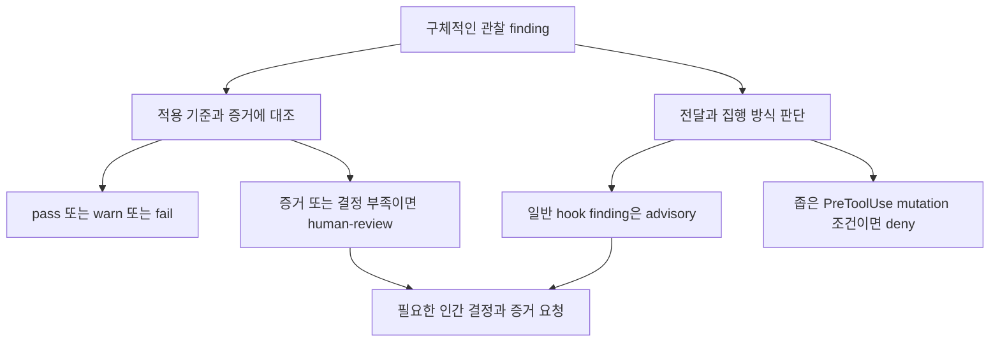

# spec-it 용어 안내

용어는 **의미를 설명하는 말**, **검토 결과를 나타내는 말**, **실행 또는 협업 방식을 나타내는 말**로 나누어 읽으면 이해하기 쉽다. 같은 단어가 다른 필드에 나타날 때는 그 필드의 계약을 확인한다. 이 안내는 비규범이며 [규칙 정본](../rules/README.md)과 [실제 스킬 계약](../skills/README.md)을 바꾸지 않는다. 처음부터 흐름을 보려면 [사용 흐름](workflow-guide.md)을 읽는다.

## 기준·조사·실행의 말

| 용어 | 쉬운 뜻 | 구체적인 예와 경계 |
| --- | --- | --- |
| SSOT | 같은 판단의 정본을 한곳에 두는 방식 | 규칙 의미는 `rules/`의 해당 ID 파일에서 읽는다. 이 안내의 요약이 새 규칙은 아니다. |
| policy / profile | 공통 규칙 체계 / 규칙 ID와 기본값을 평평하게 합성하는 묶음 | HTTP API capability가 필요하다는 후보와 프로젝트가 승인한 profile 선택을 구분한다. [프로필 안내](profiles.md) 참고. |
| manifest / lock | 승인된 선택 입력 / 그 입력을 해석한 규칙 목록과 identity | 검토는 둘을 읽는다. lock의 generated 표시가 generator 실행 증거는 아니다. [파일별 설명](workflow-guide.md#무엇을-기준으로-읽고-바꾸나) 참고. |
| pin / version / revision / digest | 고정 선택 / 발행 번호 / 실제 source revision / 정해진 내용의 hash | `0.7.0` 선택과 tag/내용 확인은 별개다. policy digest는 docs·skills·전체 리포를 식별하지 않는다. [identity 설명](workflow-guide.md#versionrevisiondigest가-각각-확인하는-것) 참고. |
| ADR | 오래 유지할 결정의 이유와 대안·재검토 조건을 남긴 기록 | DB 선택 근거를 보존한다. ADR 작성 자체로 공통 규칙 예외가 승인되지는 않는다. |
| material signal / material decision | 중요한 영향의 단서 / 사람이 정해야 할 중요한 선택 | 공개 API·저장 payload·배포 topology 변경은 단서다. 조사로 이미 승인된 guardrail 안임이 확인되면 새 질문을 만들지 않는다. |
| preflight / delta / completion | 작업 시작 조사 / 이전 조사와 차이 확인 / 완료 시 실제 변경 대조 | 영향 조사 모드다. 세 모드를 모든 작업에서 의무적으로 순회하지 않는다. |
| shadow assessment / brownfield | 채택 전 후보 평가 / 이미 존재하는 프로젝트 | manifest/lock 없는 저장소에 후보 profile을 제시한다. 채택되지 않은 규칙으로 준수·위반을 확정하지 않는다. |
| late-entry | 이미 진행된 작업에 뒤늦게 기준·의도 추적을 연결 | 현재 dirty 상태와 없는 사전 증거를 적는다. 사후 테스트를 과거 RED 테스트로 꾸미지 않는다. |
| applies / excluded / open / unknown | 조사 경로가 적용됨 / 근거 있어 제외됨 / 사람의 선택 미결정 / 접근·관찰 불가 | 원격 consumer에 접근하지 못하면 unknown이다. 이 네 말은 impact 조사 상태이며 check 결과 enum이 아니다. |
| observed / inferred / human-approved / unknown | 관측 / 추론 / 사람 승인 / 미확인 | “테스트가 실행됐다”는 로그 관측과 “배포도 성공했을 것”이라는 추론을 구분한다. 승인도 사실 관측과 구별한다. |
| evidence / freshness | 주장을 뒷받침하는 관찰 / 현재 판단에 사용할 수 있는 조건 | 과거 commit의 pass를 새 기획 revision에 그대로 적용하지 않는다. 날짜뿐 아니라 변경·환경·접근 변화의 재검토 조건을 남긴다. |
| instruction-only skill | AI에게 조사·판단·기록·인계를 안내하는 절차 | check 지시를 읽었다고 실제 검사 프로세스가 실행되거나 수리 권한이 생기지 않는다. |
| runner / adapter / hook | 실행 프로그램 / 도구별 입력·출력 변환 / event에서 프로그램을 호출하는 연결 | hook core와 독립 검증 runner는 다른 역할이다. [상태표](workflow-guide.md#두-runner와-후보의-상태) 참고. |
| active policy loop | 필요한 checkpoint에서 고정 규칙 context를 다시 제공하는 local opt-in 장치 | 모든 규칙 상시 주입·daemon·CI gate·정책 자동 업그레이드가 아니다. |
| Light / Hard | 저비용 signal 분류 / 관련 rule context 생성 | 평가 깊이이지 서로 다른 모델·스킬이 아니다. 두 단계 모두 별도 모델 호출이 없다. |
| fingerprint / dedup | event·signal·입력 hash·변경 경로 등의 식별값 / 동일 context 중복 억제 | hook session 중 같은 Hard 안내를 줄인다. 의미 검토가 정확하다는 증거가 아니다. |
| mutation / deny / fail-open | 상태를 바꾸는 호출 / 그 호출 거부 / 실행 장치 실패 시 계속될 수 있음 | PreToolUse mutation의 좁은 deny와 hook crash/timeout을 구분한다. crash를 정책 차단 성공으로 보고하지 않는다. |
| pair | 사람과 AI가 한 문제를 조사·결정·변경·확인하는 협업 방식 | 현재는 별도 미커밋 후보다. 자동 실행 장치가 아니며 새 권한을 부여하지 않는다. |

## 검토 결과의 말

| 용어 | 무엇을 말하나 | 예시 |
| --- | --- | --- |
| finding | 검토 중 발견한 구체적 관찰 | “선택된 규칙의 trigger에 해당하지만 필요한 증거가 없다.” rule ID·위치·이유·영향·다음 증거를 함께 설명한다. finding 자체는 결과 수준이나 차단 방식이 아니다. |
| advisory | 강제 차단이 아닌 안내·권고라는 처리 효과 | hook의 일반 finding은 advisory다. 적용된 pinned 의무가 없는 개선 제안도 advisory observation으로 분리한다. |
| pass | 해당 검사 범위와 증거에서 조건 충족 | check 보고서에서는 관찰된 검사 범위의 통과다. hook 내부의 Light/no-material/post-tool 제어 흐름이 반환하는 pass는 전체 정책 준수 판정이 아니다. 전체 제품 정확성·최종 승인·배포 성공을 뜻하지 않는다. |
| warn | 경고를 남기는 검사 결과 | 주의할 관찰을 남기는 결과이며 pass와 별개 상태다. 보고서 집계에는 서로 다른 규칙의 pass와 warn이 함께 있을 수 있다. 자동 수리 또는 예외 승인이 아니다. |
| fail | 적용 기준에 어긋나는 결과 | 근거가 확인된 규칙 위반을 설명한다. finding의 존재만으로 모든 결과가 fail이 되지 않는다. |
| not-applicable | 해당 기준의 적용 조건이 없음 | 해당 변경에 실제 trigger가 없다는 근거를 남긴다. 미접근이나 미실행을 이 결과로 숨기지 않는다. |
| human-review | 사람의 결정 또는 필요한 증거가 없어 통과를 확정할 수 없음 | 미결정·충돌·만료 예외·필요 증거 공백·planned-but-unimplemented 검사가 남으면 pass로 만들지 않는다. |
| planned / advisory / implemented | enforcement implementation 필드의 구현 상태 | lock의 이 필드는 check 판정 enum과 다르다. `manual + implemented`도 자동 validator가 있다는 뜻은 아니다. |
| not-implemented | 실행 구현이 없음을 설명하는 상태 | 결정적 lock generator·범용 validator가 없다. check 보고서 판정은 계약상 human-review 등으로 표현하며 임의 enum을 추가하지 않는다. |

보고서의 [check-report schema](../schemas/check-report.schema.json)는 pinned 규칙 ID에 연결된 finding을 담는다. 규칙을 발명해 advisory를 넣거나 표현되지 않은 필드를 추가하지 않는다. 요청된 advisory 지속 기록은 별도 승인된 활성 change·Issue·handoff의 담당자에게 넘긴다. check는 그 권한 없이 새 추적 시스템을 만들지 않는다.

## 혼동하기 쉬운 관계

**finding과 advisory**: 선택된 규칙에 필요한 테스트 증거가 없다는 관찰이 finding이다. 이 관찰을 현재 turn에 경고만 제공하는 것은 advisory라는 처리 효과다. finding은 발견한 내용, advisory는 강제하지 않는 방식이므로 서로 대체어가 아니다. 적용 의무가 없는 “이름을 더 알아보기 쉽게 하자”는 제안은 규칙 위반을 만들지 않고 advisory observation으로 남긴다.

**human-review와 advisory**: “복구 테스트가 실제 환경에서 실행됐는지 확인하지 못했다”는 human-review 결과가 될 수 있다. hook이 그 내용을 advisory로 보여 줄 수 있지만 결과의 증거 공백은 사라지지 않는다. advisory라서 pass가 되거나, human-review라서 모든 읽기·진단이 차단되는 것은 아니다.

**skill과 runner**: check는 고정 규칙·원문·diff·증거를 읽고 결과를 보고하는 지시다. 0.7.0 hook runner는 별도 모델을 부르지 않고 Light/Hard context를 만든다. 별도 독립 검증 runner 후보는 prepare에서 bundle을 만들고, 명시적 run에서 read-only Codex 검토를 호출하고 보고서 identity/구조를 검사한다. 보고서 구조 통과는 의미 검토의 정확성 또는 테스트 실행 증명이 아니다.

**pair와 active policy loop**: “Redis와 Transaction DB 중 어떤 경로를 선택할지 함께 살펴보자”는 사람과 AI의 pair 대화다. 요청·도구 실행·완료 event에서 고정 규칙을 다시 제공하는 것은 active policy loop다. pair는 필요한 조건에서 clarify/check 등을 사용하며, hook이 없어도 협업할 수 있다. pair 후보 파일이 있다고 release 설치에 그 기능이 생기지 않으며 hook을 켜도 사람의 선택이 자동 승인되지 않는다.

**승인과 guidance**: “이 문서만 수정해줘”는 그 문서 변경 권한이다. 규칙 card·추천·check의 pass는 다른 파일 수리·pin 업그레이드·GitHub 게시·머지·배포 권한을 부여하지 않는다. 이미 승인된 범위 안에서는 진행하고, 새 material 선택 또는 다른 외부 행동이 필요하면 실제 미결정과 권한을 구분한다. [human-in-the-loop](human-in-the-loop.md)와 [사용 흐름](workflow-guide.md#필요한-스킬만-사용하기)에 상세 인계가 있다.

이 용어들의 상태는 2026-10-03 관찰 기준이다. 발행 0.7.0, source에 남은 impact 후보 표기, 별도 pair·독립 검증 runner 후보, 미구현 집행의 근거와 재검토 조건은 [상태표](workflow-guide.md#두-runner와-후보의-상태)에서 함께 확인한다.
