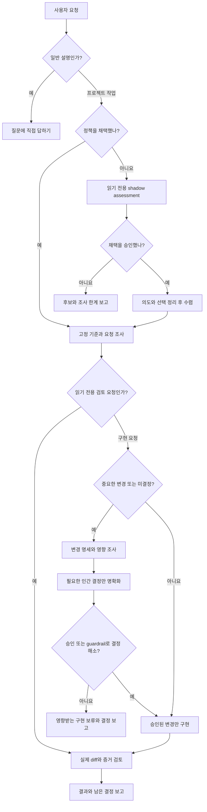
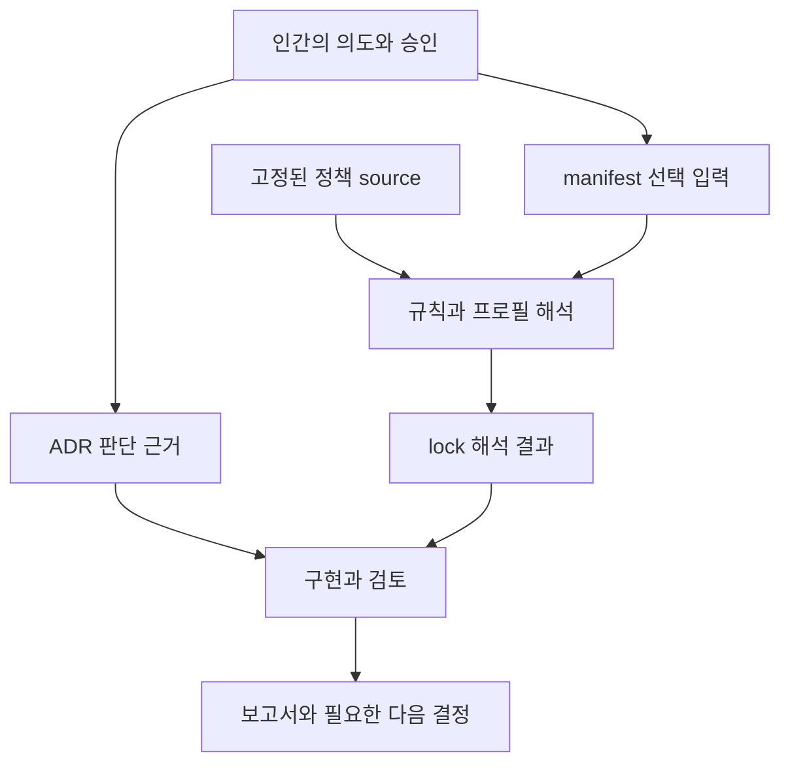

# spec-it 사용 흐름

spec-it은 **기준을 채택하고 → 그 기준과 실제 변경을 대조하고 → 근거와 남은 결정을 보고하는** 흐름이다. 사람은 목적·수용 기준·중요한 위험을 결정하고, AI는 저장소에서 사실을 조사하며 승인된 범위에서 작업한다. 이 문서는 안내이며 새 의무를 만들지 않는다. 규칙의 의미는 [규칙 정본](../rules/README.md), 권한은 [헌법](constitution.md), 적용 대상은 프로젝트가 고정한 manifest와 lock에서 확인한다. 낯선 말은 [용어 안내](terminology.md)에서 찾을 수 있다.

## 요청에서 시작점 고르기

규칙 ID나 모든 스킬 이름을 먼저 외울 필요는 없다. 요청의 성격과 정책 채택 상태부터 구분한다.

| 상황 | 짧은 요청 예시 | AI의 첫 행동과 다음 단계 |
| --- | --- | --- |
| 정책 미채택 기존 저장소 | “먼저 수정하지 말고 spec-it 채택 후보와 충돌을 설명해줘.” | 언어·실행·배포·계약을 조사하고 shadow assessment로 후보를 설명한다. 현재 코드를 승인된 의도 또는 채택된 정책으로 간주하지 않는다. 채택 승인이 있으면 필요한 명세·결정을 거쳐 수렴한다. |
| 정책 채택 완료 | “고정한 spec-it 기준으로 이 변경을 점검해줘.” | AGENTS·manifest·lock·원문·diff·증거를 읽고 check를 수행한다. 검증 요청으로 pin을 바꾸거나 코드를 수리하지 않는다. |
| 중요한 변경 | “가입 승인 API를 추가해줘.” | 공개 계약·권한·데이터 등의 material signal을 조사한다. 승인 범위와 미결정을 명세에 남기고, 미결정이 바꾸는 구현 전에 clarify로 결정한다. 이미 승인된 guardrail 안의 작업은 같은 승인을 다시 묻지 않고 계속한다. |
| 일반 설명 | “manifest와 lock은 왜 나누나요?” | 개념과 예시를 바로 설명한다. 질문만으로 정책 투영이나 pair 산출물을 만들지 않는다. |

작업이 이미 시작됐다면 `late-entry`로 실제 시작점·미커밋 상태·빠진 사전 증거를 기록한다. 사후 명세나 테스트를 과거 승인 또는 사전 실패 테스트로 소급하지 않는다. 자세한 절차는 [작업 주기](agent-work-cycle.md)와 [의도·영향·검증 연결](intent-and-verification.md)에 있다.

## 무엇을 기준으로 읽고 바꾸나

| 파일·정본 | 담는 내용과 책임 | 갱신 시점 | 검토 중 행동과 직접 수정 경계 |
| --- | --- | --- | --- |
| [AGENTS.md](../AGENTS.md) | AI의 입구. 고정 정책과 프로젝트 파일, 작업 경계를 연결 | 정책 투영 또는 프로젝트 지침 변경 | 관리 블록과 사용자 블록을 구분해 읽는다. converge가 관리 블록을 갱신하며 사용자 블록은 보존한다. |
| [project.md](../.architecture/project.md) | 목적·비목표·성공 기준·책임자 | 지속되는 목적이나 경계 변경 | 의도의 근거로 읽는다. 읽기 전용 check가 고치지 않는다. |
| [manifest.yaml](../.architecture/manifest.yaml) | 사람이 승인한 입력: policy source/version, project, profiles, owners, parameters, exceptions, units | 선택·예외·프로필·기준 version을 승인하여 변경할 때 | 검토 기준으로 읽는다. 승인된 입력 변경을 converge에 전달한다. AI가 검토 통과를 위해 선택을 몰래 바꾸지 않는다. |
| [lock.yaml](../.architecture/lock.yaml) | 입력을 해석한 결과: generated 표시, policy identity/digest, manifest digest, 선택 프로필·규칙 ID/source/enforcement·해석된 parameters/exceptions | manifest나 고정 정책이 바뀌어 다시 수렴할 때 | 생성 결과이므로 직접 편집하지 않는다. 검사할 때 읽기 전용으로 identity와 적용 규칙을 확인한다. 결정적 generator는 미구현이므로 재생성의 결정성 증거는 human-review다. |
| [ADR 예시](../.architecture/decisions/ADR-0001.md) | 오래 유지할 선택의 배경·대안·tradeoff·재검토 조건 | 중요한 선택을 승인하거나 기존 선택을 재검토할 때 | 승인 근거와 현재 변경의 관계를 읽는다. ADR은 규칙 정본을 대체하지 않는다. |
| 활성 change spec | 이번 변경의 의도·수용 기준·범위·미결정·원문/증거 연결 | material change 시작, 의도 정정, 범위/출처 변경 | specify가 최소 명세를 만든다. 완료 뒤 지속되는 선택만 프로젝트 정본·manifest·ADR로 옮긴다. [명세 템플릿](../templates/project/change-spec.md)을 참고한다. |
| [rules](../rules/README.md)·[profiles](../profiles/README.md)·[schemas](../schemas/manifest.schema.json) | 규칙 정본, 평평한 조합, 기계 판독 계약 | 승인된 공통 정책 진화 | 프로젝트 검토가 공통 규칙을 수정하지 않는다. 공통 변경은 evolve의 별도 범위다. |

예를 들어 기존 HTTP API 프로젝트에 DB 저장을 추가하려면, 먼저 실제 저장 경로와 선택된 capability를 조사한다. 사람이 필요한 선택과 guardrail을 승인하면 manifest 입력·ADR을 갱신하고 lock을 다시 수렴한다. 완료 검토는 **그렇게 채택한 기준**을 읽는다. DB 관련 finding을 없애려고 lock에서 규칙을 지우거나 검증 때 manifest를 최신판으로 바꾸는 흐름은 아니다.

단순 오탈자 수정이면 목적·프로필·정책 version이 바뀌지 않는다. 중요한 동작 변화가 없는 사유를 남기고 승인된 문서 범위에서 수정·링크 확인을 수행할 수 있다. 새 정책 release가 나왔다는 사실만으로 기존 프로젝트 pin은 변하지 않는다. 업그레이드는 [migration 안내](migrations/0.6.0-to-0.7.0.md)를 읽고 필요한 결정과 재수렴을 별도로 진행한다.

## version·revision·digest가 각각 확인하는 것

| 식별자 | 무엇을 식별하나 | 확인 범위와 한계 |
| --- | --- | --- |
| `policy.version` | 사람이 선택한 발행 정책의 정확한 SemVer, 예: `0.7.0` | Git에서는 `v0.7.0` tag를 찾는다. version 문자열만으로 실제 내용이나 수정되지 않은 소스를 증명하지 못한다. |
| `policy.revision` | 배포 수단이 제공하는 해석된 불변 source revision, Git commit 등 | [lock schema](../schemas/lock.schema.json)의 선택 필드다. Git 배포 계약은 가능한 revision을 기록하도록 한다. 현재 self lock에는 이 필드가 없다. hook reader는 version tag와 digest를 검사하며 revision 필드를 독립적으로 검증하지 않는다. |
| `policy_digest` | 정책의 정해진 내용 집합 | [TOOL-002](../rules/tooling/TOOL-002.md)의 계약대로 `VERSION`, `rules/`, `profiles/`, `schemas/` regular file을 상대 POSIX 경로순으로 정렬하고 각 path·NUL·bytes·NUL을 이어 SHA-256을 구한다. docs·skills·runner·모든 Git 파일을 식별하는 값은 아니다. |
| `manifest_digest` | 프로젝트의 선택 입력 내용 | [현재 hook reader](../src/spec_it_hook/policy.py)는 읽은 manifest 텍스트의 UTF-8 bytes를 SHA-256으로 비교한다. 같은 뜻이어도 주석·공백 변경은 digest를 바꿀 수 있다. lock의 규칙 해석이 의미상 올바르다는 증명은 아니다. |

문서 안내만 수정하면 정책 digest 범위의 내용은 그대로다. manifest에 승인된 profile을 추가하면 version이 같아도 manifest digest와 해석 결과를 다시 맞춰야 한다. version·digest·revision이 일치해도 애플리케이션이 규칙을 지켰다거나 실제 테스트가 실행됐다는 뜻은 아니다. 현재 [policy reader](../src/spec_it_hook/policy.py)는 source/version 일치, generated 표시, 로컬 tag 존재, 두 digest와 규칙 참조 구조를 확인한다. 범용 schema 검증 또는 결정적 lock 생성 전체를 수행한다고 해석하지 않는다.

## 필요한 스킬만 사용하기

스킬은 AI에게 읽을 대상·판단·산출물·경계를 안내하는 절차다. 실행 프로그램과 같지 않으며 전부 순서대로 호출하는 의식도 아니다. 논리 이름 `spec-it:*`와 설치 폴더 이름 `spec-it-*`의 관계는 [스킬 색인](../skills/README.md)에 있다. 현재 세션에서 사용할 수 없는 스킬은 호출했다고 주장하지 않고 필요한 역할과 입력을 다음 담당자에게 설명한다.

| 스킬 | 사용하는 조건 | 읽는 입력 | 반환·산출물 | 수정 권한과 다음 인계 |
| --- | --- | --- | --- | --- |
| [specify](../skills/spec-it-specify/SKILL.md) | 새 프로젝트 또는 동작·계약·보안·데이터·비용·배포·아키텍처의 material change | 요청, AGENTS, project, manifest/lock, 관련 ADR, 실제 저장소와 출처 | 최소 명세, 정상 예시·반례·유지 조건, 적용 후보와 미결정 | 명세 작성 범위이며 구현하지 않는다. 미결정은 clarify, 승인된 선택 투영은 converge, 영향 조사 필요 시 impact로 인계한다. |
| [clarify](../skills/spec-it-clarify/SKILL.md) | 결과를 바꾸는 사람의 가치·위험 선택이 남음 | 활성 명세, 근거, manifest, 관련 profile/rule | 결정 ledger, material-open 수, 실제 승인/위임 범위 | 이미 승인·위임한 선택을 다시 열지 않는다. 영향받는 명세·결정 기록을 정리하며 구현/포괄 승인을 만들지 않는다. material-open이 0이면 converge로 인계한다. |
| [converge](../skills/spec-it-converge/SKILL.md) | 중요한 미결정이 해소되고 선택 투영 권한이 있음 | 승인된 명세·ledger, profile/rule, 출처 신선도 | project·manifest·lock·ADR·AGENTS 관리 블록, 필요한 gitignore 항목 | 승인된 투영 파일만 갱신하고 기존 사용자 지침을 보존한다. hook·watcher·스킬을 암묵적으로 설치하지 않는다. check로 변경 파일과 human-review 한계를 인계한다. |
| [impact](../skills/spec-it-impact/SKILL.md) | preflight/delta/completion, brownfield, late-entry의 경로·영향 조사 | 요청·원문, 승인 근거, revision/dirty 상태, 관련 caller/consumer·설정·계약 | 적용/제외/미결정/미접근 경로, 관측 시각·신선도·재검토 조건 | 읽기 전용이다. 호출자가 이미 승인된 범위에서 지속 기록한다. 의도는 specify, 선택은 clarify, 투영은 converge, 판정은 check로 보낸다. source에 파일은 있으나 설명상 미발행 후보 표기를 유지한다. |
| [check](../skills/spec-it-check/SKILL.md) | 로컬·pre-merge·release 검토 또는 기준 불일치 조사 | 정확한 pin, manifest/lock, 예외, diff와 관련 미변경 소비자, 원문·실행 증거 | quick/full/release 판정과 finding, 증거 공백·한계 | 읽기 전용이며 수리하지 않는다. 요청된 지속 보고서만 ignored `.spec-it/reports/`에 새로 쓴다. advisory는 별도 승인된 기존 기록 담당자에게 반환한다. 필요한 결정·수정·증거를 해당 담당에게 인계한다. |
| [evolve](../skills/spec-it-evolve/SKILL.md) | 반복 근거나 필요가 입증된 공통 정책의 변경 | 사실/제안/승인을 구분한 근거, 규칙·프로필·schema, 호환성·실행 사례 | 승인된 공통 source 변경과 migration·compatibility·미구현 상태 | 요청 범위의 공통 SSOT를 변경한다. 한 프로젝트 pin 업그레이드나 패키지 발행 권한이 아니다. 해당 프로젝트는 별도 clarify/converge로 재수렴한다. |
| `pair` 후보 | 프로젝트의 설계·구현을 사용자와 작은 단계로 함께 진행 | 즉시 질문, 저장소·승인 기준·실제 결과 | 현재 가설, 의미 있는 조사/변경, 관찰 결과, 필요한 다음 선택 | 상호작용 방식이다. 새 수정·외부 행동 권한을 주지 않고 조건에 맞는 스킬만 사용한다. release checkout에는 `skills/spec-it-pair/SKILL.md`가 없다. |

예를 들어 이미 승인된 변경의 검토만 요청하면 check로 바로 시작할 수 있다. 새로운 영향이 드러나면 impact로 근거를 조사하고, 새 material 선택이 있을 때만 clarify로 돌아간다. “추천안을 써줘”라는 승인은 설명된 선택 범위에만 적용하며 미래의 모든 선택이나 머지·배포를 승인하지 않는다.

## 두 runner와 후보의 상태

다음은 **2026-10-03에 확인한 0.7.0 기준선과 별도 미커밋 후보**의 구분이다. 후보는 이 안내에 구현을 가져오지 않았으며 release checkout에서 사용할 수 없을 수 있다. 후보가 커밋·발행되거나 설치 source가 달라지면 해당 문서·코드를 다시 읽어 이 표를 갱신해야 한다.

| 대상 | 상태와 근거 | 하는 일 | 하지 않는 일·재검토 조건 |
| --- | --- | --- | --- |
| instruction-only 절차 | 발행 기준선: [specify](../skills/spec-it-specify/SKILL.md)·[clarify](../skills/spec-it-clarify/SKILL.md)·[converge](../skills/spec-it-converge/SKILL.md)·[check](../skills/spec-it-check/SKILL.md)·[evolve](../skills/spec-it-evolve/SKILL.md) | 사람이 채택한 기준을 AI가 적용하는 절차 안내 | 호출만으로 검사 실행·수정·승인을 보장하지 않는다. 설치된 skill source가 바뀌면 재확인한다. |
| impact 안내 | 현재 source에 존재하나 [스킬 색인](../skills/README.md)에서 미발행 후보로 표기 | 읽기 전용 영향·신선도 조사 절차 | 존재와 공개 채택 상태를 구분한다. release/색인 표기가 바뀌면 재확인한다. |
| hook core runner + Claude adapter | 발행 0.7.0의 local opt-in: [설명](active-policy-loop.md), [entry](../tools/spec_it_hook.py), [core runner](../src/spec_it_hook/runner.py), [adapter](../src/spec_it_hook/claude.py) | lifecycle event 분류와 pinned rule context 제공, 좁은 mutation deny | 독립 검토 모델 호출·범용 validator·CI gate가 아니다. adapter/설정·pin 변경 시 재확인한다. |
| 독립 검증 runner | 별도 미커밋 후보에서 `docs/local-verification.md`, `tools/spec_it_verify.py`, `src/spec_it_verify/runner.py` 관찰. 이 release checkout에는 없음 | prepare에서 identity·실행 bundle을 준비하고, 명시적 run에서 별도 read-only Codex 검토를 시작하며 report 계약을 검사한다. 요청과 지정 Issue가 있으면 명시적 publisher가 보고한다. | prepare는 모델 호출이 없고 run은 구독 한도를 소비할 수 있다. 테스트 자동 실행·모든 의미 검토 정확성·실계정 게시 성공을 보장하지 않는다. 후보 수정·커밋·발행 시 원문과 파일럿 증거를 재확인한다. |
| pair | 별도 미커밋 후보의 `skills/spec-it-pair/SKILL.md` 관찰. 이 release checkout에는 없음 | 사람과 AI가 가설→조사/변경→결과→다음 선택을 함께 진행하는 대화 절차 | daemon·hook·runner·자동 승인 장치가 아니다. 후보 발행·설치 후 실제 가용성을 재확인한다. |
| 결정적 lock generator·범용 validator·CI 강제 | [현재 상태](../README.md#현재-상태)와 [TOOL-002](../rules/tooling/TOOL-002.md)에 미구현/계획 상태 명시 | 목표 계약과 수동 검토의 한계를 설명 | hook identity 검사나 후보 보고서 구조 검사로 구현 완료를 대신하지 않는다. 실행 구현·적용 범위·증거가 발행될 때 재평가한다. |

후보 파일 이름은 위치를 식별하는 문자열이다. 존재하지 않는 release 경로에 링크를 만들지 않았다. 위 관찰은 정적 source 대조이며 후보 runner를 실행하거나 로그인·Issue 게시를 시험했다는 뜻은 아니다.

## hook이 안내하고 좁게 거부하는 경계

[active policy loop](active-policy-loop.md)는 별도로 켠 Claude 프로젝트에서만 동작한다. manifest/lock 채택과 local hook 활성화는 서로 다른 결정이다. `SessionStart`, `UserPromptSubmit`, `PreToolUse`, `PostToolUse`, `Stop`에서 adapter가 event를 정규화하고 core가 정책을 읽는다.

- **Light**: Python의 결정적 분류. prompt·tool input·변경 경로의 signal만 살핀다. 설명·read-only·명시적 no-change는 보통 무출력이다.
- **Hard**: material signal이면 lock의 관련 rule 원문을 고정 tag에서 읽어 현재 turn에 context를 제공한다. 최대 8개 규칙·8,000자다. Light와 Hard 모두 별도 모델을 호출하지 않는다. 선택 한도를 넘어서는 규칙이 있으면 일부만 보고 전체 pass를 추론하지 않는다.
- **일반 finding**: advisory 안내다. 사람이 정본·근거·권한에 따라 다음 행동을 결정한다.
- **좁은 deny**: PreToolUse의 mutation에서 policy identity/접근이 불능이거나 활성 명세의 material human decision이 열린 상태일 때 해당 호출을 거부한다. 읽기·진단은 허용한다.
- **실패와 완료**: hook 누락·crash·timeout은 fail-open일 수 있다. Stop은 실제 변경 신호를 재평가하고 메시지를 주며 자동 continuation이나 self-repair를 시작하지 않는다. hook 출력은 최종 승인이나 규칙 전체 검증이 아니다.

검토 보고서는 어떤 source·commit·미커밋 상태·환경·증거를 보았는지와 미접근·미실행을 함께 남긴다. 예를 들어 API 테스트가 통과해도 DB migration 실행 증거가 필요한데 없으면 그 항목은 human-review다. 더 읽을 곳은 [용어의 사례](terminology.md#혼동하기-쉬운-관계), [프로젝트 투영](project-projection.md), [검증과 증거](tdd-and-verification.md)다.
